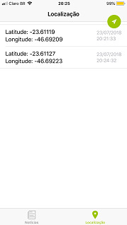
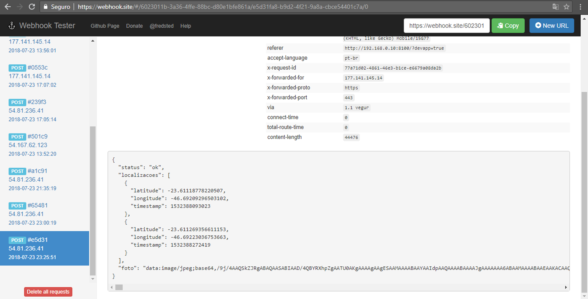

# Intelipost: Teste prático para Desenvolvedor Mobile

Este projeto refere-se ao teste da Intelipost para a vaga de Desenvolvedor Mobile.
O teste pode ser verificado em [https://github.com/intelipost/job-mobile-developer]( https://github.com/intelipost/job-mobile-developer).

## O aplicativo

O aplicativo consiste em duas páginas:

- Notícias:
Nesta página é possível verificar uma lista com 20 notícias, com título, foto e breve descrição. As notícias são provenientes do News API ([https://newsapi.org/s/google-news-api](https://newsapi.org/s/google-news-api)).
É possível atualizar a lista clicando no botão verde superior.
Caso o usuário queira ver a notícia completa, poderá clicar em qualquer local da notícia e será aberta uma página com o site original.

- Localização
Enquanto o aplicativo está em uso, são armazenadas as localizações GPS do usuário quando entra no aplicativo e a cada 3 minutos.
Esta página mostra as localizações armazanadas que ainda não foram sincronizadas.
Para sincronizar, o usuário deve clicar no botão verde no canto superior direito. Será solicitado para que tire uma selfie, que será enviada junto com os dados de localização.
Após a sincronização, os registros de localização que já foram enviados são apagados do aplicativo.

## Código do aplicativo

O código está organizado nas seguintes pastas, em \src:

- app:
O arquivo app.component.ts contém os scripts de inicialização do aplicativo, bem como a rotina que executa a verificação da localização a cada 3 minutos.
No arquivo app.module.ts, foram declarados os plugins, páginas, módulos e providers utilizados.

- domain:
Os arquivos dessa pasta contém padrões para as variáveis que armazenam notícias.

- pages:
Esta pasta contém 4 subpastas, uma para cada página do aplicativo: tabs, noticias, noticias-detalhe e localização.
Cada pasta contem seu respectivo arquivo HTLM, CSS e TS.

- pipes:
Foram criados pipes para mostrar o timestamp em formato de data e hora na página localização.

- providers:
Os serviços de geolocalização, busca de notícias e sincronização foram separados em providers, para facilitar o acesso e a manutenção.

- theme:
Nessa pasta está o arquivo variables.scss, que contém as variáveis globais de css do aplicativo. Nesse arquivo foi modificada a cor primária para verde (cor da Intelipost) e foi alterada a cor do texto nos botões nas caixas de alerta.

### Plugins utilizados

- Geolocation
cordova-plugin-geolocation
Plugin utilizado para verificar a localização do usuário quando abre o aplicativo e a cada 3 minutos.

- Camera
cordova-plugin-camera
Utilizado para tirar a selfie. A imagem em formato base64 será enviada quando form feita a sincrinização.

- In App Browser
cordova-plugin-inappbrowser
Para abertura da notícia no aplicativo.

- SQLite
cordova-sqlite-storage
Utilizado para armazenamento local dos dados até que sejam sincronizados. Foi utilizado o Storage do Ionic.

## Instalação

Instale as dependências, executando na linha de comando, na pasta do aplicativo:

    npm install

Em seguida, informe o endereço do endpoint que receberá as localizações e a selfie do usuário. Para esse teste, sugiro usar o [www.webhook.com](www.webhook.com) e copiar o endereço que será informado na página. No último parâmetro da linha abaixo, use o seu endereço.

    gulp setUrl --url https://webhook.site/#/seuendereco

Observação: O endereço tambémm pode ser alterado na linha 5 do arquivo sincronizacao-service.ts.

## Testes

Os testes podem ser feitos com o Ionic Dev App.

Na linha de comando, digite: 

    ionic serve -c

Observação: O plugin Inappbrowser, que foi utilizado para abrir a página com a notícia completa não funcionou com o IOS11. Foi verificado questionamento no fórum do Ionic, mas não há respostas.

